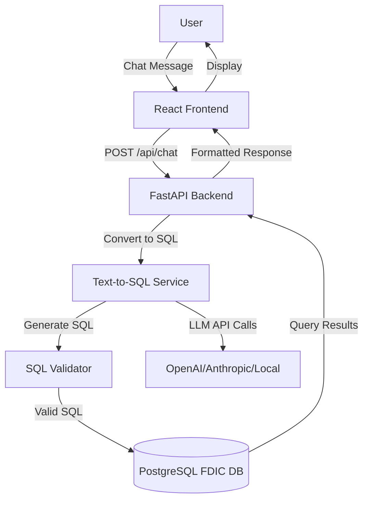

# FDIC Bank Data Chat Interface - Architecture Documentation

## Overview

This document describes the architecture of the FDIC Bank Data Chat Interface - a chat-based web application for analyzing FDIC bank data using natural language queries.

## System Architecture

The system consists of three main components:

1. **Frontend**: React-based chat interface
2. **Backend API**: FastAPI server handling chat requests, LLM integration, and database queries
3. **Text-to-SQL Service**: LLM-powered natural language to SQL conversion with safety validation



## Component Details

### Backend API Foundation

**FastAPI Application Structure**
- `backend/main.py` - FastAPI app entry point with CORS configuration
- `backend/api/chat.py` - API route handlers for chat endpoints
- `backend/services/` - Business logic layer (LLM, SQL, database)
- `backend/models/` - Pydantic models for requests/responses
- `backend/config.py` - Configuration management

**API Endpoints**
- `POST /api/chat` - Main chat endpoint
  - Accepts: `{ "message": "user question", "conversation_id": "optional" }`
  - Returns: `{ "response": "answer", "sql": "generated SQL", "data": [...] }`
- `GET /api/health` - Health check endpoint
- `GET /api/schema` - Return database schema info for LLM context

### Database Service Layer

**`services/database.py`**
- Connection pooling using psycopg2
- Query execution with timeout protection
- Result formatting utilities
- Connection to existing `config.py` for DB credentials
- Schema information retrieval from PostgreSQL information_schema

### Text-to-SQL Service

**LLM Provider Abstraction (`services/llm_providers.py`)**
- Abstract base class `LLMProvider`
- Implementations:
  - `OpenAIProvider` - OpenAI GPT models
  - `AnthropicProvider` - Anthropic Claude models
  - `LocalProvider` - Local models via Ollama
- Factory pattern for provider selection
- Configuration via environment variables

**SQL Generation Service (`services/text_to_sql.py`)**
- Build prompt with database schema context
- Include example queries from codebase
- Call LLM provider with structured prompt
- Extract SQL from LLM response (handles markdown code blocks)
- Integrates with SQL validator for safety

**SQL Safety & Validation (`services/sql_validator.py`)**
- Whitelist allowed SQL operations (SELECT only, no DDL/DML)
- Validate against database schema
- Prevent SQL injection attacks
- Check for dangerous operations (DROP, DELETE, UPDATE, etc.)
- Limit result set size (max 1000 rows)
- Add timeout protection

**Schema Context Builder (`services/schema_builder.py`)**
- Query PostgreSQL information_schema to get table/column metadata
- Build schema description for LLM prompts
- Include column types, relationships, and sample data counts
- Cache schema info for performance

### Response Generation

**Response Formatting (`services/response_formatter.py`)**
- Format tabular data for display
- Generate natural language summaries
- Handle different query types (ranking, trends, counts, ratios)
- Handle empty results with helpful messages
- Format numbers with appropriate units (B, M, K)

**Financial Metrics Calculator (`services/metrics_calculator.py`)**
- Calculate capital ratios (equity/assets)
- Growth rates (YoY, QoQ)
- Return on Assets (ROA)
- Efficiency ratios
- Industry comparisons

### Frontend Application

**React Application Structure**
- `src/App.jsx` - Main app component
- `src/components/ChatWindow.jsx` - Main chat container
- `src/components/MessageList.jsx` - Display messages
- `src/components/MessageInput.jsx` - User input form
- `src/components/SQLDisplay.jsx` - Show generated SQL (collapsible)
- `src/components/DataTable.jsx` - Display query results in table
- `src/api/client.js` - Axios client for backend communication

**Features**
- Modern, clean UI similar to ChatGPT/Claude
- Dark/light theme support (automatic based on system preference)
- Responsive design
- Markdown rendering for responses
- Real-time chat interface
- Loading states and error handling

## Data Flow

1. **User Input**: User types a natural language question in the chat interface
2. **API Request**: Frontend sends POST request to `/api/chat` with the message
3. **Text-to-SQL**: Backend uses LLM to convert natural language to SQL
4. **SQL Validation**: Generated SQL is validated for safety and correctness
5. **Query Execution**: Validated SQL is executed against PostgreSQL database
6. **Response Formatting**: Results are formatted into natural language response
7. **Display**: Frontend displays the response with data tables and SQL query

## Security Considerations

- **SQL Injection Prevention**: Whitelist approach - only SELECT queries allowed
- **Read-Only Access**: Database queries are read-only (no DDL/DML operations)
- **Query Timeout**: Maximum execution time limits prevent long-running queries
- **Result Size Limits**: Maximum 1000 rows returned per query
- **Table Whitelist**: Only allowed tables can be queried
- **Input Sanitization**: SQL queries are sanitized before execution
- **CORS Configuration**: Frontend-backend communication secured with CORS

## Configuration

Configuration is managed through environment variables and `backend/config.py`:

**LLM Provider Settings**
- `LLM_PROVIDER`: OPENAI, ANTHROPIC, or LOCAL
- `OPENAI_API_KEY`: OpenAI API key (if using OpenAI)
- `OPENAI_MODEL`: Model name (e.g., gpt-4, gpt-3.5-turbo)
- `ANTHROPIC_API_KEY`: Anthropic API key (if using Anthropic)
- `ANTHROPIC_MODEL`: Model name (e.g., claude-3-opus-20240229)
- `LOCAL_MODEL_ENDPOINT`: Ollama endpoint (default: http://localhost:11434)
- `LOCAL_MODEL_NAME`: Local model name (default: llama2)

**Query Limits**
- `MAX_QUERY_EXECUTION_TIME`: Maximum query execution time in seconds (default: 30)
- `MAX_RESULT_ROWS`: Maximum rows to return (default: 1000)

**CORS Settings**
- `CORS_ORIGINS`: Comma-separated list of allowed origins

## Database Schema Context for LLM

The LLM prompt includes:
- Table names and descriptions
- Column names, types, and meanings
- Sample queries from existing codebase
- Common banking terms and their SQL equivalents
- Relationship between tables (cert as foreign key)

### SQL Generation Prompt Template

```
You are a SQL expert for FDIC bank data. Convert the user's question to PostgreSQL SQL.

Database Schema:
[Schema details from schema_builder]

Example Queries:
- "Top 10 banks by assets": SELECT name, asset FROM institutions WHERE active = 1 AND asset IS NOT NULL ORDER BY asset DESC LIMIT 10;
- "JPMorgan deposit growth": SELECT repdte, dep FROM financials WHERE cert = 628 ORDER BY repdte;

User Question: {user_question}

Instructions:
- Generate ONLY the SQL query, no explanations or markdown formatting
- Use the most recent data available (use MAX(repdte) subqueries when needed)
- Always filter for active banks when appropriate (WHERE active = 1)
- Handle NULL values properly (use IS NOT NULL, COALESCE, NULLIF)
- Use proper JOINs to combine data from multiple tables
- Limit results appropriately (use LIMIT for top N queries)

SQL Query:
```

## File Structure

```
bank-fdic-v1/
├── backend/
│   ├── main.py              # FastAPI app entry point
│   ├── config.py            # Configuration management
│   ├── api/
│   │   ├── __init__.py
│   │   └── chat.py          # Chat API endpoints
│   ├── services/
│   │   ├── __init__.py
│   │   ├── database.py      # Database operations
│   │   ├── llm_providers.py # LLM provider abstraction
│   │   ├── text_to_sql.py   # Text-to-SQL conversion
│   │   ├── sql_validator.py # SQL safety validation
│   │   ├── schema_builder.py # Schema context builder
│   │   ├── response_formatter.py # Response formatting
│   │   └── metrics_calculator.py # Financial metrics
│   └── models/
│       ├── __init__.py
│       └── chat.py          # Pydantic models
├── frontend/
│   ├── src/
│   │   ├── App.jsx          # Main app component
│   │   ├── components/
│   │   │   ├── ChatWindow.jsx
│   │   │   ├── MessageList.jsx
│   │   │   ├── MessageInput.jsx
│   │   │   ├── SQLDisplay.jsx
│   │   │   └── DataTable.jsx
│   │   ├── api/
│   │   │   └── client.js    # API client
│   │   └── styles/
│   ├── package.json
│   └── vite.config.js
├── requirements.txt         # Python dependencies
├── README.md               # Main project documentation
├── README_CHAT.md          # Chat interface documentation
└── ARCHITECTURE.md         # This file
```

## Dependencies

**Backend:**
- `fastapi>=0.104.0` - Web framework
- `uvicorn[standard]>=0.24.0` - ASGI server
- `openai>=1.0.0` - OpenAI API client (optional)
- `anthropic>=0.7.0` - Anthropic API client (optional)
- `sqlalchemy>=2.0.0` - SQL toolkit
- `pydantic>=2.0.0` - Data validation
- `psycopg2-binary>=2.9.9` - PostgreSQL adapter
- `python-multipart` - Form data handling

**Frontend:**
- `react`, `react-dom` - React framework
- `axios` - HTTP client
- `react-markdown` - Markdown rendering
- `recharts` - Chart library (for future visualizations)
- `vite` - Build tool

## Testing Strategy

1. **Unit Tests**: SQL validation, metrics calculations
2. **Integration Tests**: LLM providers, database queries
3. **End-to-End Tests**: Complete chat flow with example queries
4. **Manual Testing**: Test with example questions:
   - "Which banks have the best capital ratios?"
   - "How has JPMorgan's deposit growth trended?"
   - "Show me banks in California with ROA > 1%"

## Deployment Considerations

- **Development**: Backend runs with `uvicorn main:app --reload`
- **Production**: Frontend build for production, backend with production ASGI server
- **Environment Variables**: Manage API keys and configuration via environment variables
- **CORS**: Configure CORS for frontend-backend communication
- **Docker**: Optional containerization for easier deployment
- **Database**: Ensure PostgreSQL is accessible and credentials are secure

## Future Enhancements

- Conversation history persistence
- Query caching for common questions
- Advanced visualizations (charts, graphs)
- Multi-turn conversations with context
- Query suggestions and autocomplete
- Export functionality for query results
- User authentication and query history
- Rate limiting per user/IP
- Analytics dashboard for query patterns
